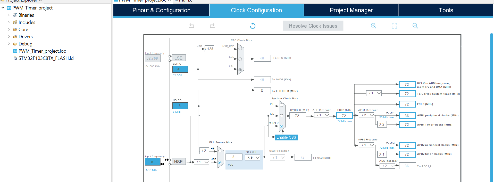
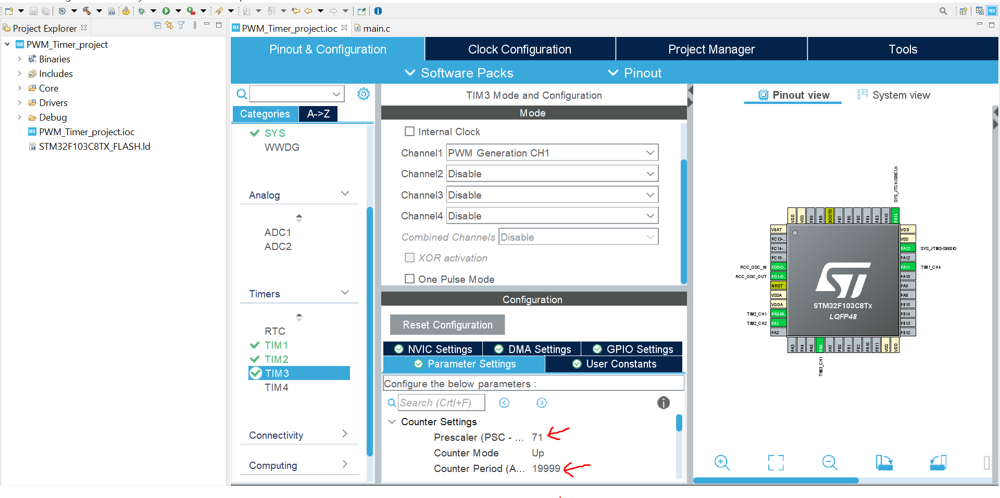

# PWM-in-STM32

This project demonstrates **PWM generation using STM32 timers**. It includes examples for:

- **Motor control** using TIM1 (50% duty cycle)
- **LED fading** with two channels on TIM2
- **Servo control** using TIM3
- Timer configuration using HAL library, with flexible frequency, PSC, and ARR settings
- Non-blocking updates using `uwTick` for smooth PWM changes

It’s a simple and practical reference for beginners learning **STM32 PWM applications**.

## Clock Configuration

Before using the timers, you **must configure your system clock** according to the frequency you want.  
For this project, the STM32F103C8 is configured to run at **72 MHz**.  



⚠️ **Attention:**  
- Check the **APB1 and APB2 bus frequencies** because they may differ from the system clock.  
- Timers connected to APB1 or APB2 will have different input clocks if the bus is prescaled. Adjust your **PSC (Prescaler)** and **ARR (Auto-Reload Register)** accordingly to get the desired PWM frequency.
## Timer Configuration: PSC, ARR, and Pulse

To generate PWM signals, you need to configure three main parameters in your timer:

1. **PSC (Prescaler)** – divides the timer input clock to slow down the timer counter.  
2. **ARR (Auto-Reload Register)** – defines the maximum count value of the timer. When the counter reaches ARR, it resets to 0.  
3. **Pulse (Compare value)** – sets the duty cycle of the PWM:  
   - `Pulse / ARR × 100%` gives the percentage of high time in the PWM period.

The **timer frequency** is calculated as:

\[
f_{PWM} = \frac{Timer\ Clock}{(PSC + 1) \times (ARR + 1)}
\]



⚠️ **Tip:**  
- Make sure to consider the **APB1/APB2 timer clocks** when calculating PSC and ARR.  
- For a 50% duty cycle, set `Pulse = ARR / 2`.  
- You can change the `Pulse` value to adjust the duty cycle dynamically, e.g., for LED fading or motor speed control.
## Timer Summary

Here is a summary of the timers used in this project, their configuration, and main functions:

| Timer  | Channel | Purpose                   | PSC | ARR    | PWM Frequency | Duty Cycle Example | STM32 HAL Functions Used          |
|--------|--------|---------------------------|-----|--------|---------------|-----------------|----------------------------------|
| TIM1   | CH4    | Motor Control             | 71  | 49     | 20 kHz        | 50%              | `HAL_TIM_PWM_Start`, `__HAL_TIM_SET_COMPARE` |
| TIM2   | CH1/2  | LED Fading (2 channels)   | 71  | 999    | 1 kHz         | 0–100% dynamically | `HAL_TIM_PWM_Start`, `__HAL_TIM_SET_COMPARE` |
| TIM3   | CH1    | Servo / Example           | 71  | 19999  | 50 Hz         | 50%              | `HAL_TIM_PWM_Start`, `__HAL_TIM_SET_COMPARE` |

**Notes:**  
- **PWM Frequency** is calculated using:

\[
f_{PWM} = \frac{Timer\ Clock}{(PSC + 1) \times (ARR + 1)}
\]

- You can dynamically change the PWM duty cycle using:

```c
__HAL_TIM_SET_COMPARE(&htimX, TIM_CHANNEL_Y, dutyValue);
